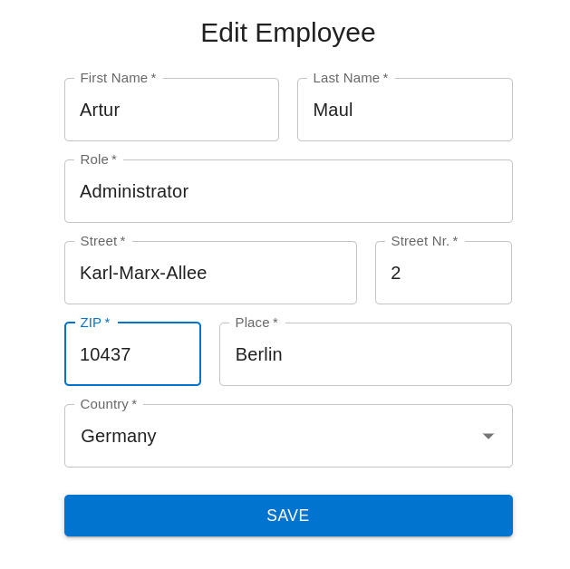

# Employee Registry

# Running

You can run it using docker compose just by `docker-compose up -d`. The web application will be available on this address by default: http://localhost:8000

# Testing

There are some API tests for the backend application. It can be started by `BASE_URL='http://localhost:8000' npm run test:api` from the `employee-register-backend` folder. ❗Please consider that the tests will affect your database. For correct tests usage your database have to be empty. 

# Application request:

Our stakeholder is missing an overview of their employees. So far, they don’t use any professional tool to manage their employees. So, they requested us to create an employee management application.

The stakeholder requested following feature bundles in sequence:

**Bundle 1:**
-  Registration page so every employee can register itself
-  Employee must login before being able to use the application
-  Landing page as overview of existing employees
**Bundle 2:**
-  A logged in employee can add another employee
-  Ability to import employees over a CSV file
**Bundle 3:**
-  Being able to edit and delete employees
**Bundle 4:**
-  Add and display comments to employees on employee detail page
-  Display author and date of the comment

## Additional information:

- An employee data includes:

    - username
    - email
    - last name
    - first name
    - address
    - role

- A comment consists of multiline text